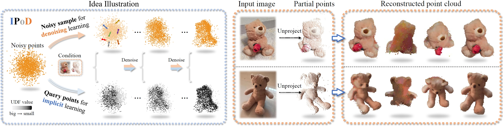
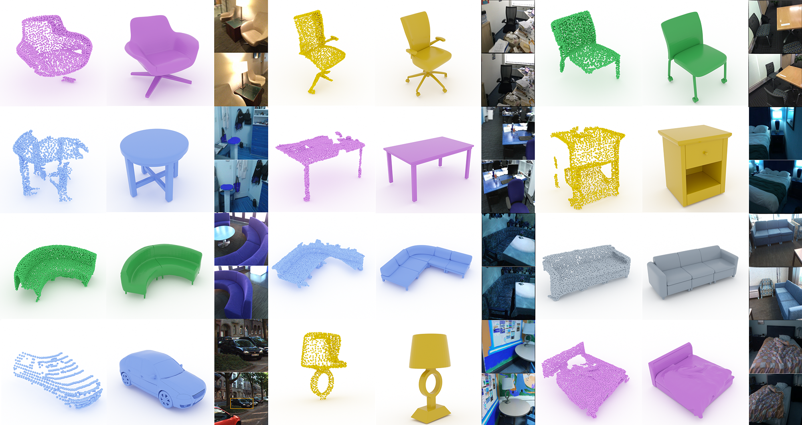
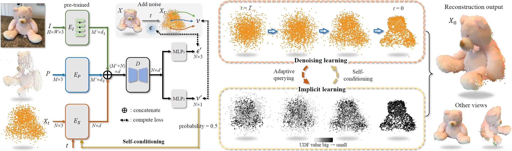

# IPoD
> IPoD: Implicit Field Learning with Point Diffusion for Generalizable 3D Object Reconstruction from Single RGB-D Images 
> [GAP Lab](https://gaplab.cuhk.edu.cn/), [Yushuang Wu](https://scholar.google.com/citations?hl=zh-CN&user=x5gpN0sAAAAJ)

[Paper](https://arxiv.org/abs/2304.10179.pdf) - 
[Project Website](https://yushuang-wu.github.io/IPoD/) -
[Arxiv](https://arxiv.org/abs/2304.10179) -
Published in CVPR 2024.

#### Citation

If you find our code or paper useful for your project, please consider citing:

    @inproceedings{wu2024ipod,
      title={IPoD: Implicit Field Learning with Point Diffusion for Generalizable 3D Object Reconstruction from Single RGB-D Images},
      author={Yushuang, Wu and Luyue, Shi and Junhao, Cai and Weihao, Yuan and Lingteng, Qiu and Zilong, Dong and Liefeng, Bo and Shuguang, Cui and Xiaoguang, Han},
      booktitle={The IEEE/CVF Computer Vision and Pattern Recognition Conference (CVPR)},
      year={2024},
    }

## ScanSalon Dataset

We build a new dataset, ScanSalon, for the shape completion of real scans, with 800 mesh-scan pairs in 6 classes: chair, desk, sofa, bed, lamp, car. We provide videos in our [project page](https://yushuang-wu.github.io/SCoDA/) for data sample visualization. 

> ScanSalon Data: At [Google Drive](https://drive.google.com/file/d/1FhgKm3h6o6OITwqugQlLqQrAQRVswe6T/view?usp=sharing) (Updated on 9/22/2023) (paired data only).   
> ShapeNet Data: Turn to [ShapeNet](https://shapenet.org) for synthetic data download.   
> Further details about ScanSalon: Please refer to the README and scripts in the ScanSalon zip package.  Refer to [here](https://github.com/I-am-Future/scansalon-preprocess-scripts) to find out how do we extract point clouds for this dataset. 

## Installation

Our implementation is based on IF-Net as the basic framework for reconstruction. Please refer to the "Install" part of [IF-Net](https://github.com/jchibane/if-net) for the installation of our method. 

## Running

1. Following the steps in data_processing/mesh-fusion to get the water-tight ScanSalon meshes.  
2. Following the steps in [Mesh2PC](https://github.com/kochanha/Mesh-to-Pointcloud-using-Blensor) to get simulated scans from ShapeNet meshes.  
3. Following the steps in data_processing/process.sh to preprocess all data.  
4. Run `train_ddp.sh` to train the model in a parrallel way.  
5. After training by around 30-50 epochs, run `generate_ddp.sh` to generate meshes in the test set. 

