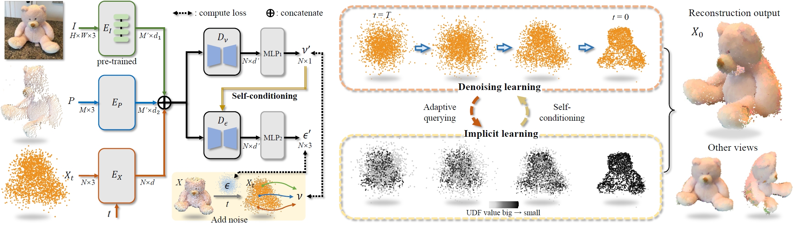
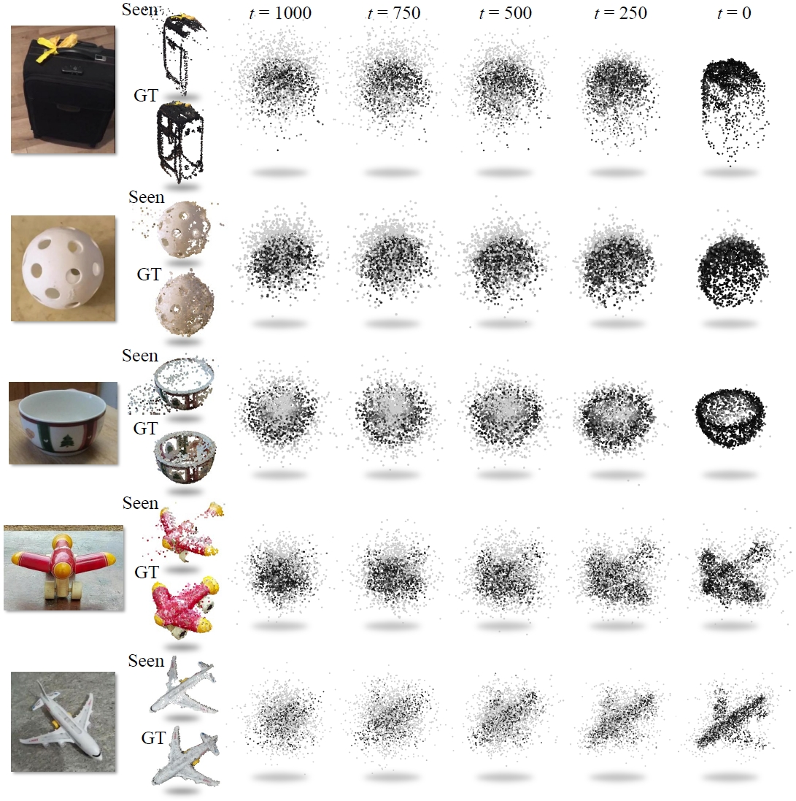
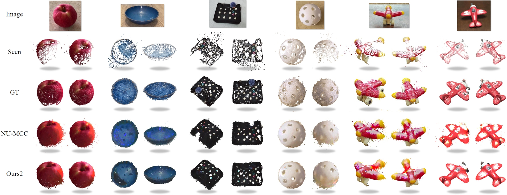
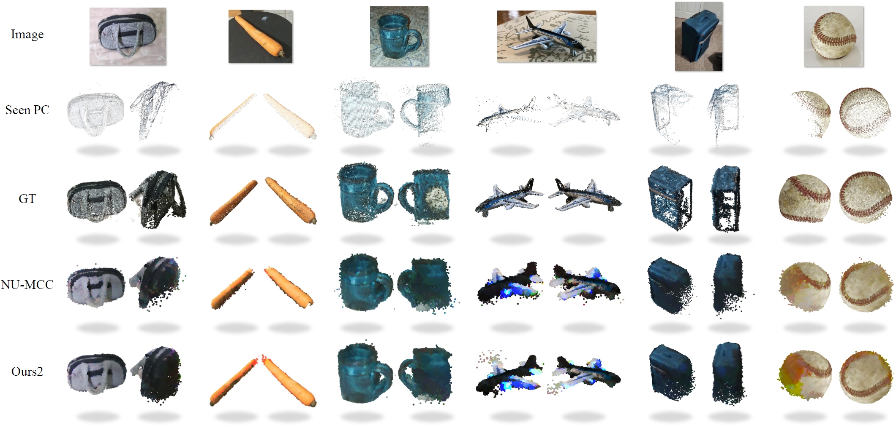
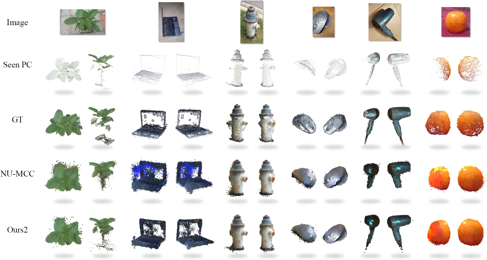
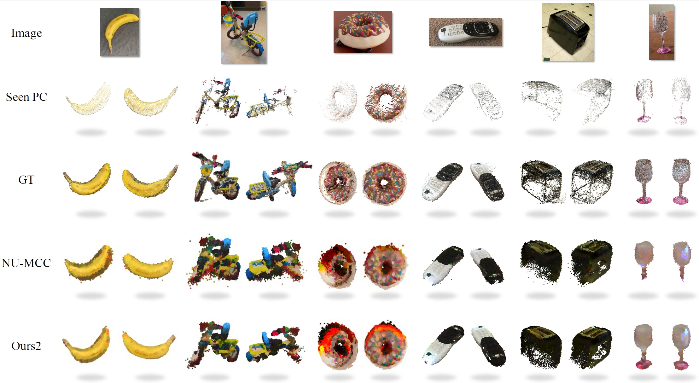
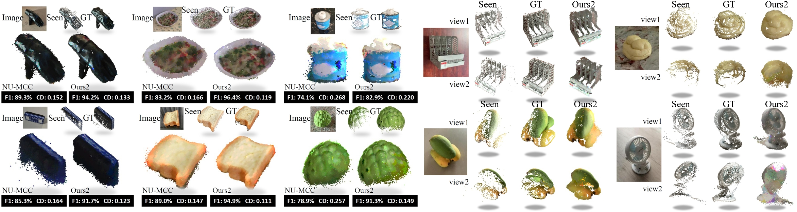

# IPoD: <u>I<u>mplicit Field Learning with <u>P<u>oint <u>D<u>iffusion
> IPoD: Implicit Field Learning with Point Diffusion for Generalizable 3D Object Reconstruction from Single RGB-D Images<br />
> [GAP Lab](https://gaplab.cuhk.edu.cn/), [Yushuang Wu](https://scholar.google.com/citations?hl=zh-CN&user=x5gpN0sAAAAJ)


[Paper](https://arxiv.org/pdf/2404.00269) - 
[Project Website](https://yushuang-wu.github.io/IPoD/) -
[Arxiv](https://arxiv.org/abs/2404.00269) -
Published in CVPR 2024 **(Highlight)**.

#### Citation

If you find our code or paper useful for your project, please consider citing:

    @inproceedings{wu2024ipod,
      title={IPoD: Implicit Field Learning with Point Diffusion for Generalizable 3D Object Reconstruction from Single RGB-D Images},
      author={Yushuang, Wu and Luyue, Shi and Junhao, Cai and Weihao, Yuan and Lingteng, Qiu and Zilong, Dong and Liefeng, Bo and Shuguang, Cui and Xiaoguang, Han},
      booktitle={The IEEE/CVF Computer Vision and Pattern Recognition Conference (CVPR)},
      year={2024},
    }

This work was done by Yushuang Wu during intership at Alibaba Group supervised by Weihao Yuan. [Official Code Link](https://github.com/alibaba/ipod).


## Installation
Please see [INSTALL.md](INSTALL.md) for information on installation.


## Data
Please see [DATASET.md](DATASET.md) for information on data preparation.

## Pretrained models

To download the pretrained models (on CO3D-v2), run:

```
mkdir ckpts

cd ckpts

wget https://virutalbuy-public.oss-cn-hangzhou.aliyuncs.com/share/YushuangWu/IPoD_ckpts/ipod_transformer_co3d.pth

```


## CO3D-v2 Experiments

To train from scratch, run:
```
sh train.sh
```

The arguements are used the same with ones in the repository of [NU-MCC](https://github.com/sail-sg/numcc).

For evaluation/inference:

```
sh eval.sh
```

The argument `--n_query_udf` defines the total number of points in the final output. In general, the higher numbers result in more uniform point distribution and also longer inference time. 


To run visualization, use `--run_viz` flag. The output will be generated to the folder specified in `--exp_name`. Visualization/evaluation from one class can be specified using `--one_class [OBJECT_CLASS]` flag. Point clouds can be exported by activating `--save_pc` flag.

## Methodology



## Denoising Visulization

<div align=center>

</div>

## Reconstruction Visualization


On CO3Dv2 held-out categories:<br />




On CO3Dv2 held-in categories:<br />




On MVImgNet:<br />



## Acknowledgement
This codebase is mainly inherited from the repositories of [NU-MCC](https://github.com/sail-sg/numcc) and [MCC](https://github.com/facebookresearch/MCC).
